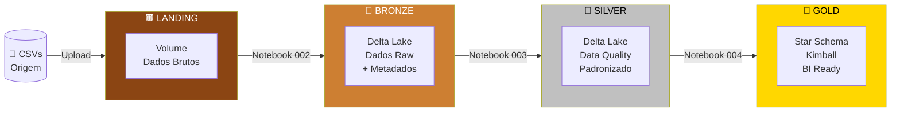

# 🏆 Lakehouse com Databricks — Arquitetura Medalhão

Bem-vindo à documentação do projeto de **Engenharia de Dados** desenvolvido como atividade prática do curso de Engenharia de Software.

---

## O que é este projeto?

Este projeto implementa um **Lakehouse** completo utilizando a plataforma **Databricks Community Edition** com **Delta Lake**, seguindo a **Arquitetura Medalhão** — um padrão moderno de engenharia de dados que organiza os dados em camadas progressivas de qualidade e transformação.

O domínio de negócio escolhido é um sistema de **Seguro de Veículos**, com dados de apólices, sinistros, clientes, veículos e localidades.

---

## Fluxo do Pipeline

---

## Tecnologias

| Tecnologia | Papel no Projeto |
|-----------|-----------------|
| **Databricks Community** | Plataforma de execução e orquestração |
| **Apache Spark / PySpark** | Engine de processamento distribuído |
| **Delta Lake** | Formato de armazenamento ACID |
| **Unity Catalog** | Governança e catálogo de dados |
| **SQL** | Transformações e modelagem |

---

## Navegação

Use o menu superior para acessar:

- **🏗️ Arquitetura** — Entenda o modelo de dados e as camadas
- **📓 Notebooks** — Código e explicação de cada etapa
- **📋 Guias** — Como configurar e usar o Databricks

---

!!! tip "Primeira vez aqui?"
    Comece pelo guia [Como usar o Databricks](guias/databricks-guia.md) e depois siga a ordem dos notebooks.
